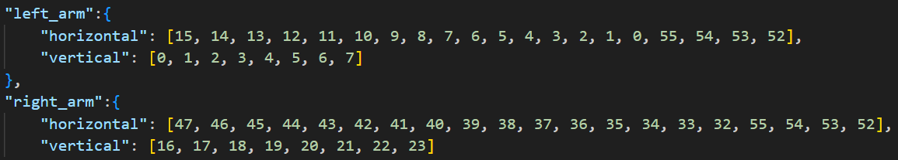
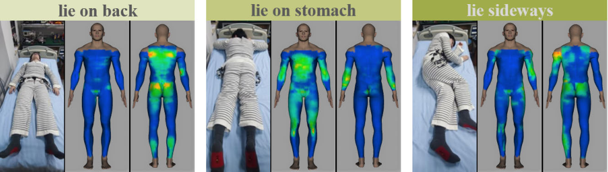
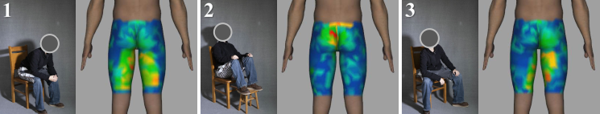

# Smart Garment: A long-term feasible, whole-body textile pressure sensing system  
This repository holds the python demo of pressure data visualization system by Dongquan Zhang.  
## Quick start  
The demo is implemented using package PyQt5 v5.15.6, vtk v9.1.0 and OpenCV (opencv-contrib-python v4.6.0.66).  
You can check out the visualizing result by running demo_script.py using the following command.
```
python demo_script.py ./example/[cloths_data_file_name].npy ./example/[pants_data_file_name].npy
```

## Configuration file
Configuration file **./config/config.json** helps the system adapt to different data arrangements and sizes.  

The .json file records the location of horizontal/vertical sensing stripes on the human body. To make localization easier, the human body is viewed as 5 cylinders (left/right arms, left/right legs and torso). The sensing stripes cover the cylinders equally in horizontal and vertical directions.

Thus, the arrays recorded in **./config/config.json** represent the order of stripes on the cylinders. E.g., for cylinder left_arm **(class ARM (mode=left))**, horizontal order starts from variable **self.reference** and vertical order **self.start**.

For more detailed algorithm, please refer to our work “Smart Garment: A long-term feasible, wholebody textile pressure sensing system”.

## Uses in publicated works
“Smart Garment: A long-term feasible, wholebody textile pressure sensing system,” _IEEE Sensors Journal_, 2023.  



“A Single-Ply and Knit-Only Textile Sensing Matrix for Mapping Body Surface Pressure,” _IEEE Sensors Journal_, 2024.  

